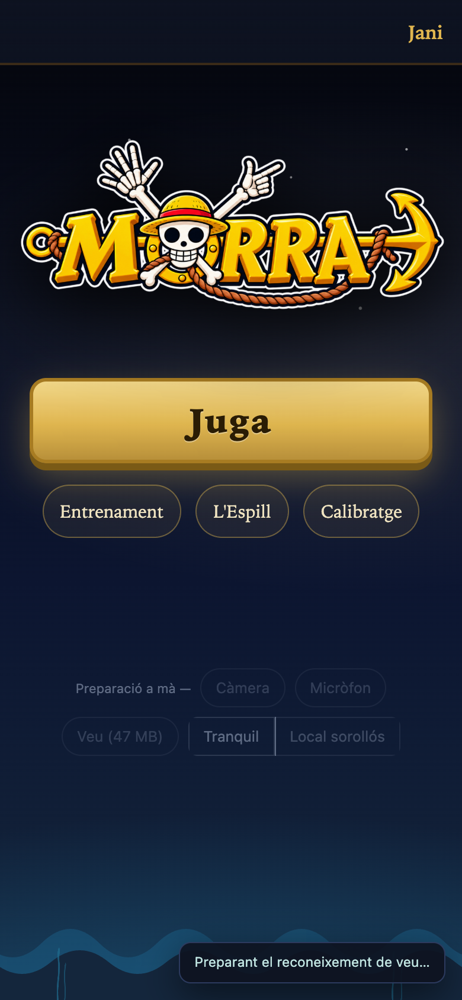
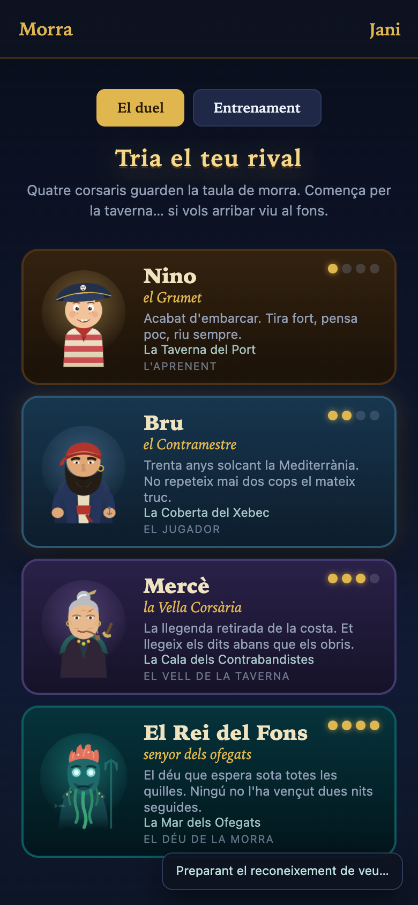
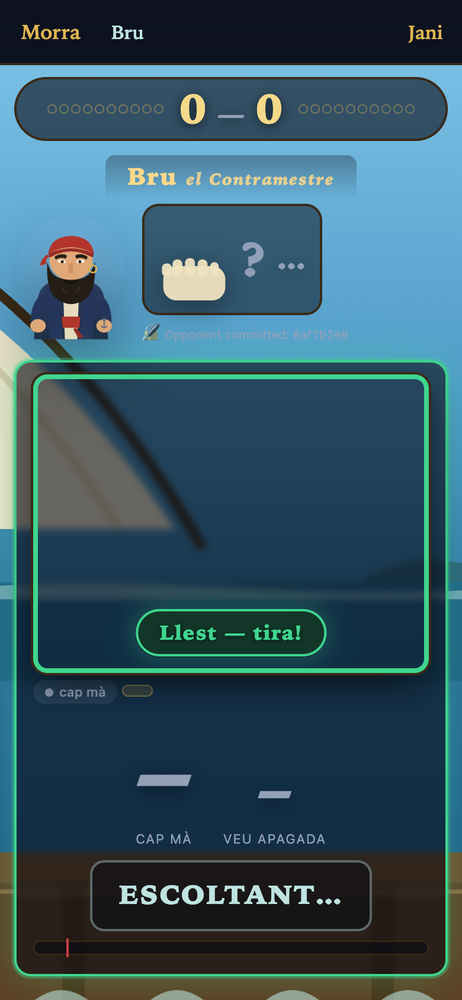
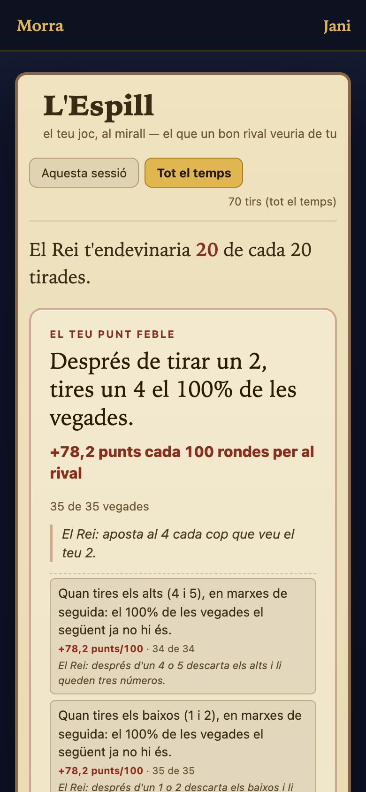

<p align="center">
  
</p>

<h1 align="center">Morra</h1>

Play [morra](https://en.wikipedia.org/wiki/Morra_(game)) — the Mediterranean
finger-and-shout game — against an AI corsair, in the browser. You throw
fingers and call your guess of the total out loud; the rival's move is
cryptographically committed *before* you throw and revealed the instant your
hand settles, so it can never peek. First to 10, `parata` (tie) scores
nobody.

Two channels have to land together: the camera counts your fingers
(MediaPipe HandLandmarker) and the mic hears your number (vosk, Catalan). A
throw only *synces* when hand and voice co-occur within the window — that
simultaneity is the whole game, and it's what the pipeline is built around.

> Skin: **ux-pirates** — four corsairs (Nino, Bru, Mercè, El Rei del Fons)
> mapped onto the engine's four AI levels. The names are presentation only;
> the difficulty comes from the engine.

## The game, screen by screen

| The tripulants | The duel | L'Espill |
|:---:|:---:|:---:|
|  |  |  |
| Pick one of four corsairs — the ladder runs from the tavern to the drowned deep. | The rival's move is sealed above; your hand and shout land together below. | The mirror: what a sharp rival reads in you, and the habit that costs you most. |

<sub>Captured on a phone viewport (the app is built mobile-first). The camera
feed — where your own hand shows — is blanked in these shots.</sub>

## Quick start

```bash
pnpm install          # repo root, first time only
./play.sh app         # apps/play dev server → http://localhost:5173
```

Open in **real Chrome** (headless can't do camera/mic), grant camera + mic,
tap **Juga**, pick a rival, throw. Everything else — the diagnostics, the
Entorn noise presets, the finger-count corpus recorder — lives behind the
**mode tècnic** drawer (press `T`).

Run the reference spike side by side to compare feel:

```bash
./play.sh             # the s03 spike on http://localhost:8080
```

## What's in here

A pnpm monorepo. The **spikes are the source of truth** — `spikes/**` is the
proven reference implementation, kept byte-untouched, and everything else is
a port verified against it (see "The spike is the truth" below).

| Path | What |
|---|---|
| `apps/play` | The game. Vanilla TS, no framework — a spike-faithful port of `spikes/s03-beat.html`. Its own [README](apps/play/README.md) + step-at-a-time [`VERIFY.md`](apps/play/VERIFY.md). |
| `packages/core` | `@morra/core` — pure rules / commit-reveal / scorer / AI / player-model. No DOM, no globals; all impurity enters through `src/ports/`. Ported from `spikes/modules/*.mjs`. |
| `packages/recognition` | `@morra/recognition` — the finger counter and voice/onset detectors, extracted from the s01/s03 spikes. |
| `packages/platform-web` | `@morra/platform-web` — browser adapters: one shared AudioContext + clock mapping, device access, `localStorage`/telemetry ports. |
| `spikes/` | The five Step-0 spikes and their run-sheet ([README](spikes/README.md)). The regression oracle. |
| `scripts/` | `cross-check-conformance.mjs` (core vs spike), `eval-counting.mjs` (finger-count rule evaluator). |
| `docs/` | Field playtest analyses, the finger-counting accuracy investigation, AI + UX design, security audit. |

## The spike is the truth

The methodology, and why the test suite looks the way it does: the spikes
were validated with real people before any monorepo existed, so the port
must stay provably equivalent to them.

- **Conformance** (`pnpm cross-check:conformance`) replays 105 cases through
  the untouched `spikes/modules/*.mjs` and `@morra/core` — zero discrepancy.
- **Parity** (`apps/play` `pnpm test:parity`) drives the live spike and the
  built app through one identical seam and asserts the same branch on every
  scenario.
- **Unit** (`pnpm test`) covers each package; deliberate divergences from
  the spike (e.g. the finger-count thumb rule, the throw-of-one reveal) are
  each documented in-code and pinned by their own tests + fixtures.

A change that alters game behavior is expected to keep conformance and
parity green, or to state the divergence and prove it on data.

## Commands

Run from the repo root:

```bash
pnpm build                    # build every package + the app (tsc + vite)
pnpm test                     # unit tests across the workspace
pnpm cross-check:conformance  # @morra/core vs the untouched spike
pnpm lint

cd apps/play
pnpm test:integration         # headless smoke over the built dist (needs Chrome)
pnpm test:parity              # live spike vs app, identical scenarios
node test/shots.mjs           # regenerate docs/screenshots from the built dist
```

Full-gate expectation on a clean tree today: unit **540** (core 285 ·
recognition 96 · platform-web 55 · app 104), conformance **105/105**,
`apps/play` integration **118/118**, parity **18/18**.

## Requirements

Node 20+ · pnpm 11 · a Chromium browser with a camera and mic. The Catalan
voice model (~47 MB) downloads on first use; MediaPipe/vosk are fetched from
CDN unless vendored (`apps/play/scripts/prepare-assets.mjs`).
